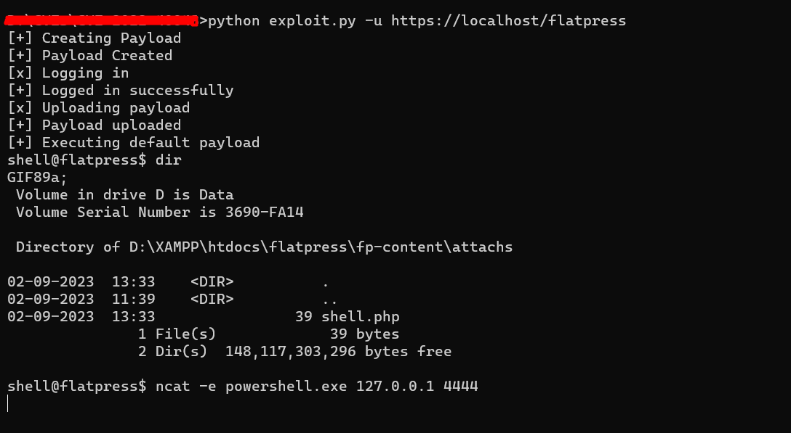
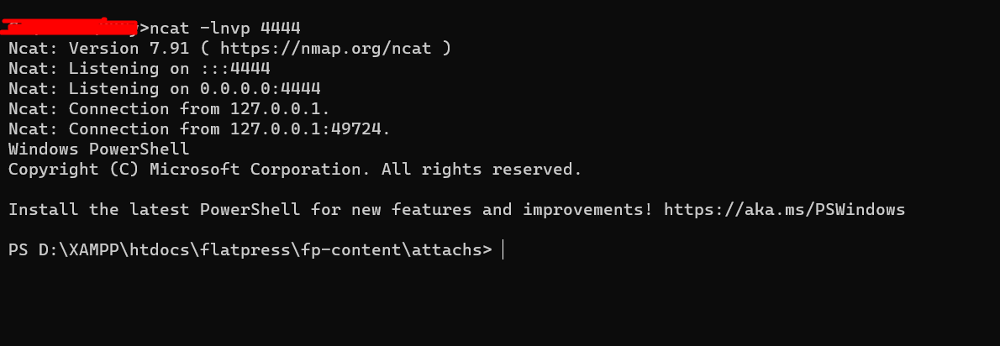

# CVE-2022-40048 

This Python script is an exploit for a vulnerability in flatpress (CVE-2022-40048)

## Prerequisites

- Python 3.x
- Selenium (`pip install selenium`)
- Requests (`pip install requests`)

## Usage

Run the script with the following command-line arguments:

- `-u` or `--URL`: The URL of the target site.
- `-un` or `--USERNAME`: The username for login (default is "admin").
- `-p` or `--PASSWORD`: The password for login (default is "password").
- `-f` or `--FILE`: (Optional) Path to a custom payload file.

Example usage:

```bash
python exploit.py -u https://example.com -un admin -p mypassword -f custom_payload.php
```


## Screenshots





## References

- [CVE-2022-40048](https://github.com/flatpressblog/flatpress/issues/152)
